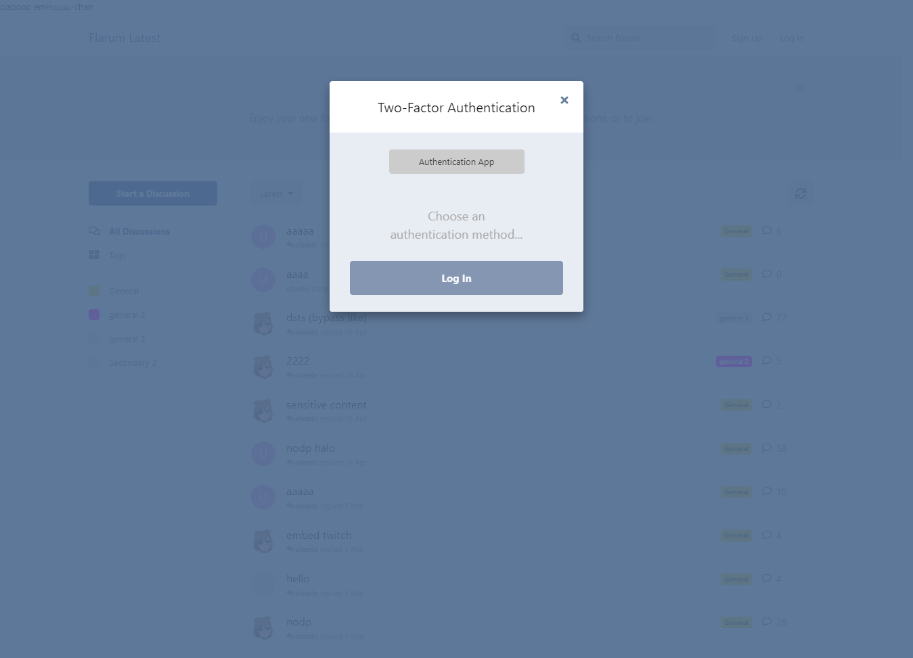

# Screenshots

## Login

## User Settings

## User Controls (Admin view)

- Admins can disable any two-factor authentication method of a user
- Admins can't disable two-factor authentication of other admins

## Admin Extension Settings

